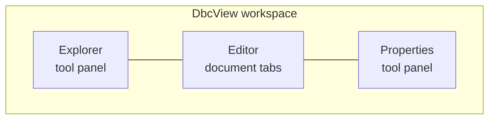
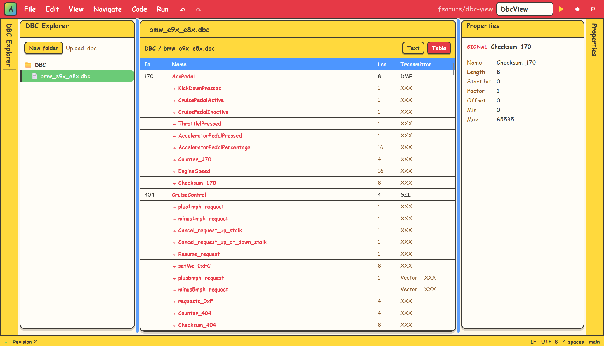
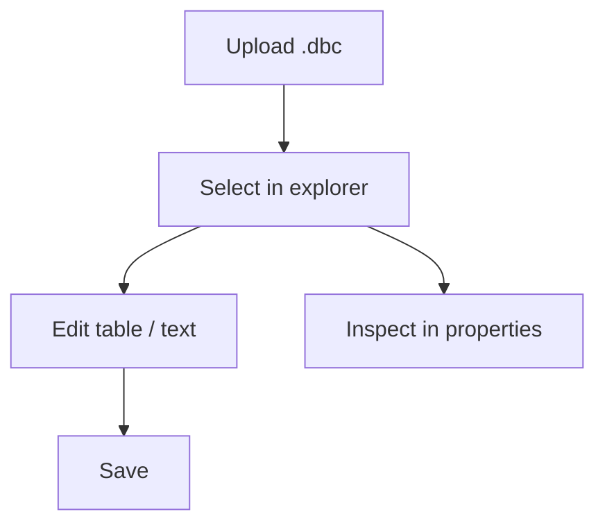

# DbcView

English | [简体中文](README.zh.md)

**A standalone Blazor WebAssembly application for browsing and editing CAN
database (DBC) files.**

## Features

| Capability | Description |
|---|---|
| DBC file explorer | Folder/file tree with local `.dbc` upload |
| Message & signal editor | Table view and raw text view, switchable per document |
| Properties panel | Instant inspection of the selected file, message, or signal |



## Screenshot



## Try it online

<https://wubing7755.github.io/DbcView/> — no installation required.

## Quick start

Requires the .NET 6 SDK.

```bash
dotnet restore DbcView.sln --configfile NuGet.Config
dotnet build DbcView.sln --no-restore
dotnet test DbcView.sln --no-build --no-restore
dotnet run --project src/DbcView/DbcView.csproj --no-restore
```

Open the URL printed by `dotnet run`.

## How to use



## Project structure

```text
DbcView/
├── src/DbcView/          Blazor WASM app
│   ├── Components/       workspace host + panels
│   ├── Models/Dbc/       DbcDocument, DbcMessage, DbcSignal
│   ├── Services/         DbcParser, DbcFileStore
│   ├── ViewModels/       tree / editor / property models
│   └── Pages/            Index (/), Verification (/verification)
├── tests/DbcView.Tests/  xUnit + bUnit tests
├── samples/              sample CAN database files
└── assets/               README screenshot
```

## Sample data

`samples/bmw_e9x_e8x.dbc` is a community-maintained CAN database for BMW
E9x/E8x vehicles, sourced from
<https://github.com/dzid26/opendbc-BMW-E8x-E9x> (MIT licensed; see the
`CM_ "License MIT"` comment in the file header).

## Disclaimer

The sample file is provided for demonstration and testing only. It is not
endorsed by or affiliated with BMW; "BMW" and vehicle names are trademarks
of their respective owners. The data may be inaccurate or outdated — do not
use it in production vehicles.
