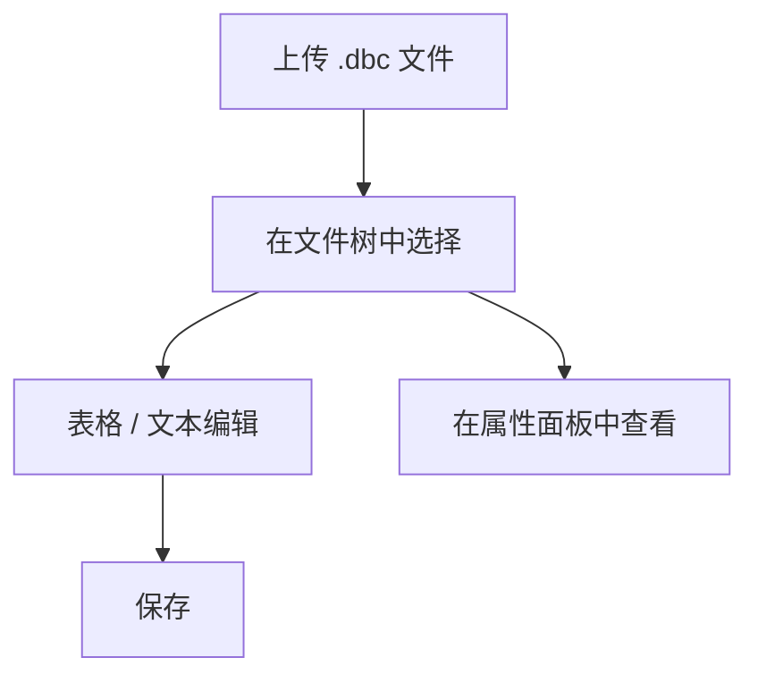

# DbcView

[English](README.md) | 简体中文

**一个用于浏览和编辑 CAN 数据库（DBC）文件的独立 Blazor WebAssembly 应用。**

## 功能特性

| 能力        | 说明                       |
| --------- | ------------------------ |
| DBC 文件浏览器 | 文件夹/文件树，支持本地 `.dbc` 文件上传 |
| 消息与信号编辑器  | 表格视图与原始文本视图，每个文档可切换      |
| 属性面板      | 即时查看所选文件、消息或信号的属性        |


## 界面截图


## 在线试用

<https://wubing7755.github.io/DbcView/> — 无需安装，直接访问即可使用。

## 快速开始

需要 .NET 6 SDK。

```bash
dotnet restore DbcView.sln --configfile NuGet.Config
dotnet build DbcView.sln --no-restore
dotnet test DbcView.sln --no-build --no-restore
dotnet run --project src/DbcView/DbcView.csproj --no-restore
```

打开 `dotnet run` 输出的 URL。

## 使用方法



## 项目结构

```text
DbcView/
├── src/DbcView/          Blazor WASM 应用
│   ├── Components/       工作区宿主与面板
│   ├── Models/Dbc/       DbcDocument、DbcMessage、DbcSignal
│   ├── Services/         DbcParser、DbcFileStore
│   ├── ViewModels/       文件树/编辑器/属性视图模型
│   └── Pages/            Index (/)、Verification (/verification)
├── tests/DbcView.Tests/  xUnit + bUnit 测试
├── samples/              样例 CAN 数据库文件
└── assets/               README 截图
```

## 样例数据

`samples/bmw_e9x_e8x.dbc` 是社区维护的 BMW E9x/E8x 车型 CAN 数据库文件，来源为
<https://github.com/dzid26/opendbc-BMW-E8x-E9x>（MIT 许可；见文件头
`CM_ "License MIT"` 注释）。

## 免责声明

样例文件仅用于演示和测试。与 BMW 无任何关联或认可关系；"BMW" 及车辆名称均为
各自所有者的商标。数据可能不准确或已过时，请勿用于生产车辆。
